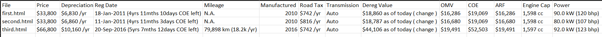

##  Data Scraper

This Python script extracts key vehicle information (e.g., *Price, Depreciation, Reg Date, Mileage*, etc.) from offline HTML files and outputs the data into a structured CSV file.

It uses **BeautifulSoup** for parsing and **pandas** for data handling.

---

### Features

* Works **offline** with downloaded `.html` pages.
* Extracts only the following fields:

  ```
  Price, Depreciation, Reg Date, Mileage, Manufactured, Road Tax,
  Transmission, Dereg Value, OMV, COE, ARF, Engine Cap, Power,
  Curb Weight, No. of Owners, Type of Vehicle
  ```
* Handles multiple HTML layouts (`<td>` tables and `<div>` blocks).
* Cleans unwanted text like “View models with similar depre” and “(change)”.
* Exports clean tabular data to CSV.

---

### Requirements

Install dependencies using:

```bash
pip install beautifulsoup4 pandas
```

---

### Folder Structure

```
Question1/
 ├── first.html
 ├── second.html
 ├── third.html
 ├── extract_sgcarmart.py
```

---

### Usage

1. Place your HTML files inside the `Question1` folder.
2. Run the script:

   ```bash
   python extract_sgcarmart.py
   ```
3. The cleaned data will be saved as:

   ```
   car_data.csv
   ```

---

### Output




---

## Data Engineering Task

### Overview

This task automates the process of maintaining a master car listing database.
It compares new listings (`NewData.csv`) with an existing master database (`MasterDB.csv`), identifies new, updated, and sold listings, and outputs an updated dataset.

---

### Requirements

* Python 3.8 or above
* Required libraries:

  ```bash
  pip install pandas
  ```

---

### How to Run

1. **Navigate to the folder:**

   ```bash
   cd "E:/Data Project"
   ```

2. **Run the script:**

   ```bash
   python append_data.py
   ```

3. **Output:**

   * The script will generate a file named **`Updated_MasterDB.csv`** containing:

     * All valid new car listings (Status = *Available*, with non-N.A. Price and COE)
     * Updated existing car details
     * Removed cars with Status = *Sold*

---

### Folder Structure

```
Question1/
 ├── append_data.py
 ├── MasterDB.csv
 ├── NewData.csv
```

---

### Script Logic Summary

1. **Read input CSV files:**

   * Loads both `MasterDB.csv` and `NewData.csv` using `pandas`.

2. **Filter valid new entries:**

   * Only includes rows where:

     * `Status == "available"`
     * `Price` and `COE` are not `"N.A."`

3. **Identify and append new rows:**

   * Compares by `"Car Name"`.
   * Adds only cars not already in the master database.

4. **Update existing rows:**

   * Replaces any changed data for matching `"Car Name"` entries.

5. **Remove sold cars:**

   * If `Status == "Sold"` in `NewData.csv`, that car is deleted from the master file.

6. **Save the final output:**

   * Exports the cleaned and updated master database as `Updated_MasterDB.csv`.

---

### Output


---

### Notes

* The comparison key is **`Car Name`**, assumed to uniquely identify listings.
* The script automatically skips incomplete rows or invalid entries.
* Future versions can enhance this by normalizing price fields and adding data quality checks.

---

# Car Data Analysis & Processing Pipeline

## Overview

This project performs **data cleaning, feature extraction, analysis, and clustering** on a car resale dataset.
It converts raw scraped data into a structured, analyzable format and generates insights about price, mileage, and COE expiry trends.

---

## Steps Performed

### 1. **Data Loading**

* Reads the raw dataset `masterdata.csv` using **pandas**.
* Initial inspection of column names and row counts.

### 2. **Car Name Parsing**

* Extracts `Car Make`, `Car Model Name`, and `COE End Date` from the messy `Car Name` field using **regex**.
* Handles patterns like:

  * `COE till 07/2022`
  * `New 10-yr COE`

### 3. **Date Conversion**

* Converts text-based COE dates to proper `datetime` objects.
* Fills `NaT` for invalid or missing dates.

### 4. **Numeric Cleaning**

* Cleans and converts text columns (e.g. `$55,800`, `165,200 km`) into numeric format.
* Creates new numeric fields:
  `Price_num`, `Mileage_num`, `OMV_num`, `COE_num`, etc.

### 5. **Statistical Summary**

* Computes **Mean, Median, Mode, Standard Deviation**, and **±3σ range** per Car Make.
* Exports results to `car_make_statistics.csv`.

### 6. **Visualizations**

* **Boxplot**: Price by Car Make
* **Histogram**: Mileage distribution
* **Bar chart**: COE expiry trends by year

### 7. **K-Means Clustering**

* Uses **Price** and **Mileage** to cluster cars into 3 groups.
* Visualizes the clusters with a scatter plot.

### 8. **Data Export**

* Cleaned dataset → `processed_masterdata.csv`
* Summary statistics → `car_make_statistics.csv`

---

## Outputs

| File                         | Description                                                                   |
| ---------------------------- | ----------------------------------------------------------------------------- |
| **processed_masterdata.csv** | Cleaned, feature-rich dataset with parsed columns and cluster labels.         |
| **car_make_statistics.csv**  | Statistical summary (mean, median, mode, std) for each car make.              |
| **Plots**                    | Boxplots, histograms, and COE expiry bar charts (displayed during execution). |

---

## Requirements

```bash
pip install pandas numpy seaborn matplotlib scikit-learn
```


---